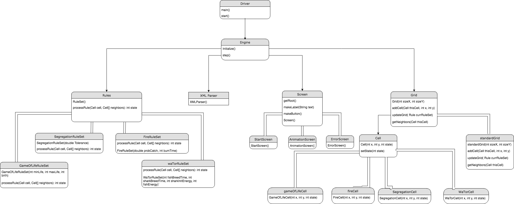

# cellsociety
CompSci 308 Cell Society Design Plan

## Team 1
* Ben Hodgson
* Katherine Van Dyk
* Michael Acker

## Introduction
Our goal is to create a cellular automata program that can accurately animate a grid of cells,  given a set of rules within an XML file. Our program should be flexible enough such that it can handle any type of legal rule set, and can easily be adapted to add new types of simulations, grids, and cells.
To accomplish this, we will create a cell object that is closed to all other cells and only knows of its own state. A grid object will hold an array of cells and have knowledge of all cells in it. The ruleset has no knowledge of the cells or grid, and an engine class will create an instance of the grid and apply the ruleset to all cells in the grid by passing the rule set as a parameter to some methods within the grid class.

## Overview
Our program consists of a Driver class, which includes the main method and any global variables. The Driver class calls an instance of the Engine class, which handles all instance variables and the current state of the simulation. The Engine class, in its initialization, calls the XMLParser() class, which iterates through all files in the 'XML' directory to create rulesets/grids for each type of simulation the user defines. Grids are made of cell objects. The Engine class includes a step function and processes the current grid based on its corresponding ruleset. The Screen class is also under the engine and updates the screen based on the current state of the simulation. It also includes subclasses for the start screen and error screen. An overview of each component and its specific classes are below. See the 'Design Details' section for a more in-depth description of a specific class' implementation and links to other classes. 

Below is a diagram of the design. Arrows represent calls to a certain class, while thick lines represent subclasses.




### 1. Cell Object

#### Description
The cell object is a single 'pixel' on the grid that has a current state and a previous state. Cell states can be manipulated by the Grid class based on simulation rules. A Cell superclass serves as a template for cell subclasses, which add specific features to the superclass implementation, such as specific display features and other parameters besides state.

#### Methods/Subclasses

#####  `Cell(int x, int y, int state)`

Superclass constructor that creates an initial cell object based on the cell coordinates (x,y) and the initial state (an integer).

##### `setState(int state)`

Superclass method that sets a cell object to the input state.

##### `GameOfLifeCell(int x, int y, int state)  extends Cell`

Game of Life cell constructor that creates a cell object to be used in the Game of Life simulation.

##### `WaTorCell(int x, int y, int state)  extends Cell`

Predator-prey cell constructor that creates a cell object to be used in the predator-prey simulation.

##### `FireCell(int x, int y, int state)  extends Cell`

Fire cell constructor that creates a cell object to be used in the Fire simulatio

##### `SegregationCell(int x, int y, int state)  extends Cell`

Segregation cell constructor that creates a cell object to be used in the Segregation simulation.

### 2. Grid Object
#### Description
A grid is an arrangement of cell objects where cell states can be updated based on a ruleset, which uses the cell's neighbors as input. The `Grid` class is a superclass which will be extended by our `StandardGrid`  subclass. The `StandardGrid` subclass implements a 2D array of cells, where cells are wrapped such that each cell has exactly 8 neighbors. The grid class and its methods to update the state of cells are detailed below.

#### Methods/Subclasses

##### `Grid(int sizeX, int sizeY)`
Initializes the grid by creating an empty array of cells with dimensions sizeX and sizeY.
##### `standardGrid(int sizeX, int sizeY) extends Grid`
Initializes a standard grid (2-D array) of dimensions sizeX x sizeY.

##### `addCell(Cell thisCell, int x, int y)`
This method adds a cell object to a Grid at the specified index location.

##### `updateGrid(Rule currentRuleSet)`
This method updates the entire grid based on the input ruleset. It loops through each cell and uses the currentRuleSet’s `processRules()` method to get a cell’s current state, and the cell’s`setState()` method to set the cell’s new state.

##### `getNeighbors(Cell thisCell)`
This is a private method that returns the a specific cell's neighbors. This method is utilized by the `updateGrid()` method.

### 3. RuleSet Class
#### Description
The ruleset superclass initializes a template for cells to be updated by any simulation. Each simulation extends the RuleSet class and overrides the `processRules()` and constructor methods. The `initialize()` method of the game engine calls the RuleSet constructor and inputs any simulation parameters. The grid class calls the RuleSet `processRules()` method to find the current cell state. 

#### Methods/Subclasses
##### `RuleSet()`
Superclass constructor.

##### `processRules(Cell thisCell, Cell[] neighbors)`
Superclass method that returns the current state for thisCell. This method is overridden by each of the ruleset subclass.

##### `GameOfLifeRuleSet(int minLife, int maxLife, int birth)`
Constructor for the Game of Life simulation’s ruleset where minLife and maxLife parameters refer to the minimum and maximum number of living neighbor cells allowed for a living cell to survive, and the birth parameter is the exact number of neighbor cells required for a dead cell to come to life.

##### `FireRuleSet(double probCatch, int burnTime)`
Constructor for Fire Simulation’s ruleset where probCatch is the probability of a tree cell next to a burning cell to ignite and burnTime is the number of turns a cell burns before becoming empty.

##### `WaTorRuleSet(int fishBreedTime, int sharkBreedTime, int sharkInitEnergy, int fishEnergy)`
Constructor for Wa-Tor World Simulation’s ruleset where fishBreedTime is the number of turns of life required for a fish to breed, sharkBreedTime is the number of turns of life required for sharks to breed, sharkInitEnergy is the initial amount of energy a shark has, and fishEnergy is the amount of energy provided to a shark by eating a fish.

##### `SegregationRuleSet(double tolerance)`
Constructor for Segregation Simulation’s ruleset where tolerance is the percentage of neighbors of the same type a cell must have in order to be satisfied with its position.

### 4. Driver/Engine
#### Description
The Driver class contains the main method and creates an instance of the Game Engine, which holds the current simulation state, including instance variables and the display components. The Engine() class serves as a superclass for the Grid, Screen and RuleSet classes. It calls the XML parser and holds all grids/rulesets specified by the XML files in protected HashMaps. '

#### Driver Methods
##### `Main()`
Main method.
##### `start()`
Creates stage/animation and creates an instance of Engine.
#### Engine Methods
##### `Initialize()`
Calls the XML parser to parse the input files and create grids/rulesets for the different types of animations. Also calls `StartScreen()` subclass to update display to the Start Screen and waits for user input to begin the simulation and generate the animation screen.

##### `step()`
The step function calls the Grid class’ `updateGrid()` method to update the cell state continuously if the user hits play, or one generation at a time, if the user hits the ‘step through’ button. The `step()` function also generates the new display by calling the Screen class’ `getRoot()` method after each iteration.

### 5.  Screen
#### Description
The Screen class is a super class that contains some basic methods used to generate some scene roots. The sub classes can be used to make more specific aspects of the layout, such as `GenerateStartScreen`, which returns the root collection for the start scene. 

#### Methods/Subclasses
##### `makeLabel(String text)`
Creates a label with the desired text and the default styling format for the program

##### `makeButton(String text)`
Creates a button with the desired text and the default styling format for the program

##### `getRoot()`
Returns the root to be used for the specified scene

##### `ErrorScreen()`
Returns a collection of objects to be displayed for the Error Screen, which includes a text label indicating the error.

##### `AnimationScreen()`
Returns a collection of objects to be displayed for the Animation Screen, including a toolbar and grid. 

##### `StartScreen()`
Returns a collection of objects to be displayed for the Start Screen, which includes a dropdown menu to select the initial simulation and a Start button.

### 6. XML Parser
#### Description
The XML parser scans each file in the XML directory of the application. The format of the XML file is detailed in Design Details. On a high level, each XML file/simulation is stored in a HashMap, where its key is its name. The XML file is a subclass of Engine() and populates the Grid and RuleSet hash maps stored in the Engine class. Hash maps were chosen as the data structure to hold all grids/rulesets because of the quick access time and ability to hold multiple simulations with different names, even if they're of the same type (the HashMap is indexed by Simulation name). 
#### Methods
##### `XMLParser()  extends Engine`
Calls XML parser class to iterate through all files in the XML directory.

## User Interface
The user interface for the program will consist of two screens: a start screen and an animation screen. The start screen features a drop down menu with a start button. The user chooses an initial simulation from the dropdown list. When they select a simulation, the start button becomes clickable and the user is then directed to the simulation screen.


The animation screen, as shown in Figure 2, features a grid on the left side of the screen and a toolbar on the right. The toolbar features a step button, to iterate through the simulation one generation at a time, a play button, to play the animation continuously, a pause button, to stop the animation at any time, and a refresh button, to reset the simulation to its initial state. A dropdown menu at the right allows the user to switch simulations. The ‘Go’ button becomes clickable once a simulation is chosen. The grid features an array of ‘Rectangle’ shapes, which are stored in the cell object and extracted by the Screen class described in the Design Overview/Details portion of the document.


Having drop down menus to switch between simulations/start eliminations eliminates the user’s selection form being a source of error. Our program will handle a bad input data or empty input data by showing an “Error Screen”, or a screen with text warning the user that they have entered an invalid XML input file. The default cell state is 0, and hence simulations will not run with no input data.

## Design Details
### Components
#### 1. Cell Object
A cell is one element of the grid, which has one or more states, whose behavior from generation to generation is described by the states of its neighbors. It will be defined as an abstract class so that it is flexible enough to accommodate multiple different types of cells as subclasses, depending on the needs of different automata simulations. Information stored in a cell should include one or more states, as well as corresponding previous states, its coordinates on the grid, and different colors/shapes to accommodate a visual difference between states in the animation. Methods for the cell class should be a constructor, set current state, set previous state, get current state, get previous state, and display shape.

#### 2. Grid
The grid contains a two-dimensional array of cells. It is initialized in the game engine, and it contains all cells in the simulation and is responsible for systematically updating the states of each cell based on the states of its neighbors for each generation. The grid is defined as an abstract class so that it has the flexibility necessary to implement different types of grids if need be. Information stored in the grid should be the array of all cells and the coordinates of each cell such that it can determine the set of neighbors for any given cell. Methods for the grid class should be a constructor, get initial state (from XML file), update grid (to update cells’ states each generation), and get neighbors (to return the set of neighbors for a cell).

#### 3. Rules
The rules superclass has four subclasses, and contains one method `processRules()` that takes a cell object input and returns the correct state for the cell in the current generation. The rules superclass has four subclasses, each with its own constructor that takes in initial parameter inputs, depending on the type of simulation. Each subclass overrides the `processRule()` method with its own ruleset and cell object type. An abstract class is used for the rules class so that another simulation’s ruleset can be easily added and be consistent with the format of other rulesets.

The XML parser class constructs a ruleset for each simulation in the input XML file, using the given input parameters, which is explained further in the ‘Design Details’ section. The rulesets are stored in a HashMap, and the Engine class assigns the ‘mainRuleSet’ variable to the appropriate HashMap entry, using the simulation type as the key.  The Game Engine applies the ruleset process method to each cell when updating each generation.

#### 4. Driver/Engine

The Driver class contains the main method and any global variables. It calls an instance of the Game Engine, which holds the current state of the simulation- including instance variables such as grid size, simulation type, and the current grid/the state of the cells contained within it. The Engine class also contains a step method, which updates the state of the cells for each generation, and also the display, by calling the Screen class.

#### 5. Screen


#### 6. XML Parser
The XML Parser is a subclass of the Game Engine. The Game Engine calls the XML Parser once during its initialization. The XML Parser reads all input files in the ‘XML’ directory of the application. The anticipated template for the XML files is outlined in the Design Details section. For each XML file/simulation, a grid and ruleset are constructed from the input parameters and stored within two hashmaps in the Game Engine class, which are protected and therefore accessible by the XML parser class. If the XML parser is missing data that can be easily set to a default value, such as an input parameter for a function, no error screen will be thrown. If it encounters a missing cell, however, an error screen is thrown. Once the XML parser has finished, rule sets and grids should exist for each XML file, mapped by their simulation names.

Below is the anticipated XML file format. ‘Const’, although not necessarily applicable for the Fire simulation ruleset, is a general constant denoting any parameters for the ruleset.

```xml
<game>
	<simulation>
		<name> Blinking Fire <\name>
<type> Fire <\type>
		<const> 2 <const>
		<sizeX> 100 <\sizeX>
		<sizeY> 100 <\sizeY>
		<cell>
			<positionX> 1 </positionX>
			<positionY> 10 </positionY>
			<initState> 0 </initState>
			<probCatch>.5 <probCatch>
		</cell>
	</simulation>
</game>
```

### Use Cases
#### 1. Applying Rules to Middle Cell

Call the `updateGrid(Rule currentRuleSet)` in the Grid object to update the state of the Cells. This method loops through each cell and calls the private static method `getNeighbors(Cell thisCell)` that returns the neighboring cells in the grid. The object currentRuleSet contains a method `processRule(Cell thisCell, Cell[] neighbors)` that **returns** the new state for thisCell based off neighbors. This state is then applied to the Cell using its `setState(int state)` method. In this specific case, the `currentRuleSet` would be specific to the Game of Life rules and its method `processRule` would count the number of neighbors and return the state **dead**. This state would then be set as the Cell’s next state using the Cell’s `setState` method. States will be represented by int values.

#### 2. Applying Rules to Edge Cell

In our program, edge cells will wrap around and treat cells on the opposite edge as its neighbor. This way every cell has a complete set of neighbors. Calculating the neighbors this way will be handled in the Grid objects `getNeighbors(Cell thisCell)` method by checking the index value of the Cell’s location in the array of Cell objects located in the Grid object. Therefore, the steps to set the next state of a cell to live are the same as the ones used for a middle cell, only in this case the `currentRuleSet` would be specific to the Game of Life rules and its method `processRule` would count the number of neighbors and return the state **live**. This state would then be set as the Cell’s next state using the Cell’s `setState` method. States will be represented as int values.

#### 3. Move to the Next Generation
Call the update method in the Grid object to update the state of the Cells, `updateGrid(Rule currentRuleSet)`. This method is described in detail in the **Applying Rules to Middle Cell** use case. The cell objects at this point in the program will have their shapes (rectangles, circles, etc) stored as nodes in the current scene root, so to update the scene graphically the `setState()` method in each cell can correspondingly change the size, fill, etc. of the shape object contained within each cell depending on the state, which is represented by an int value.

#### 4. Setting Simulation Parameters
The Game Engine calls the XML Parser class, which scans each XML file in the XML directory with the correct tags. It then matches the simulation name to the simulation type, which is a string variable stored in the Driver class. A grid is then constructed for each simulation based on the cell object, which is determined using the simulation type. If at any point the XML file deviates from the expected format, a default value is used if appropriate (e.g., probCatch or initialState is missing), or an error screen is thrown (e.g, if an entire cell is missing). All four initial grids are stored in a HashMap, with the simulation type as a key. This hashmap is stored in the gameEngine and can be called depending on the simulation that the user chooses.
The ruleset is constructed using the XML file as well, using the initial ruleset parameters. Rulesets for each simulation are also stored in a HashMap within the Engine and have the simulation type as a key.

#### 5. Switching Simulations
A drop down menu on the side of the animation screen, as displayed above under the **User Interface** heading, will be used to switch between simulations. The game engine will have hash map instance variables from the XML Parser class with String object keys mapping to a Cell object array that contains the initial Cells. Depending upon the button, it will retrieve the correct array of initial Cell objects and reset the grid with these new Cell objects using the `createGrid(Cell[] cellObjects)` method within the grid Class.

## Design Considerations

### 1. Cell abstract class:
#### Pros:
More flexibility, some animations may require the cells to have different properties.
All cell subclasses can be referenced as Cell types
All cell subclasses share basic methods
#### Cons:
Size - Object oriented programming approaches create larger programs. In this case an extra class is needed to serve as a super class for the different cell subclasses.
To add a new type of cell, must create an additional cell subclass.

### 2. Separate driver and simulation engine classes
#### Pros:
Driver creates an instance of the simulation, so multiple simulations can be generated and running simultaneously
#### Cons:
Size - Object oriented programming approaches create larger programs. In this case an extra driver class is used to separate the steps required to start and execute a simulation.

### 3. Rules abstract class:
#### Pros:
More flexibility, some animations may require different rules
Every rule set can be referenced as a Rules type.
#### Cons:
To add a new set of rules, must create a new rules subclass
Size - Object oriented programming approaches create larger programs. In this case an extra class is needed to serve as a super class for the different rule sub classes.
### 4. Creating an XML Parser class
#### Pros:
Using a class with the specific task of reading through the XML file and storing its data eliminates the need to reread the file if the animation type is changed later during the program. For example, to change from one animation type to another mid simulation the engine class can reference this object to find the initial starting Cell properties it stored from the XML file. This data will be stored in a hashmap with simulation titles as String object keys mapping to a Cell object array that contains the initial Cells. This lookup time is O(1) and prevents from having to reprocess the file.

Separating this functionality also makes the code more readable and adaptable since any feature changes or additions related to processing data from the XML file can be handled in this one class.

#### Cons:
Creates a dependency upon this object. To re-initialize the grid for a certain simulation the program depends upon the data taken from this object. This class must tell the program this information.
Size - An extra class is used to handle reading the XML as opposed to doing so within another, pre-existing class

### 5. Creating a Screen class
#### Pros:
Enhanced readability and flexibility. If a new scene is needed for an aspect of the program, say a start scene, the program can call a method in this class to construct and return the root for the scene and attach this root to the current game scene. This way adding new scenes to the program can be done by creating a new method in this class to generate its nodes, put them in a root, and return this root.

#### Cons:
Size - requires an extra class to handle creating new scenes.
Dependency - the program is dependent upon values returned from methods in this class to generate new scenes
## Team Responsibilities
This section describes the program components each team member plans to take primary and secondary responsibility for and a high-level plan of how the team will complete the program.


