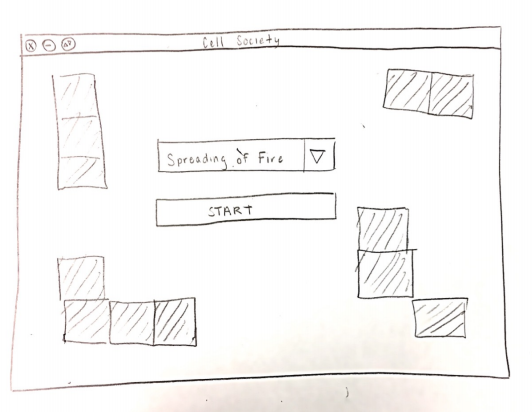

# cellsociety
CompSci 308 Cell Society Design Plan

## Team 1
   * Ben Hodgson
   * Katherine Van Dyk
   * Michael Acker

## Introduction

Our goal is to create a cellular automata program that can accurately animate a grid of cells,  given a set of rules within an XML file. Our program should be flexible enough such that it can handle any type of legal rule set, and can easily be adapted to add new types of simulations, grids, and cells. 
To accomplish this, we will create a cell object that is closed to all other cells and only knows of its own state. A grid object will hold an array of cells and have knowledge of all cells in it. The ruleset has no knowledge of the cells or grid, and an engine class will create an instance of the grid and apply the ruleset to all cells in the grid. 

## Overview
This section serves as a map of your design for other programmers to gain a general understanding of how and why the program was divided up, and how the individual parts work together to provide the desired functionality.
 As such, it should describe specific components you intend to create, their purpose with regards to the program's functionality, and how they collaborate with each other. 

It should also include a picture of how the components are related (these pictures can be hand drawn and scanned in, created with a standard drawing program, or screen shots from a UML design program).

 This section should discuss specific classes, methods, and data structures, but not individual lines of code.
### Cell Object
A cell is one element of the grid, which has one or more states, whose behavior from generation to generation is described by the states of its neighbors. It will be defined as an abstract class so that it is flexible enough to accommodate multiple different types of cells as subclasses, depending on the needs of different automata simulations. Information stored in a cell should include one or more states, as well as corresponding previous states, its coordinates on the grid, and different colors/shapes to accommodate a visual difference between states in the animation. Methods for the cell class should be a constructor, set current state, set previous state, get current state, get previous state, and display shape.

### Grid Object
The grid is a two-dimensional array of cells. It is initialized in the game engine, and it contains all cells in the simulation and is responsible for systematically updating the states of each cell based on the states of its neighbors for each generation. The grid is defined as an abstract class so that it has the flexibility necessary to implement different types of grids if need be. Information stored in the grid should be the array of all cells and the coordinates of each cell such that it can determine the set of neighbors for any given cell. Methods for the grid class should be a constructor, get initial state (from XML file), update grid (to update cells’ states each generation), and get neighbors (to return the set of neighbors for a cell)
### Rules Class
 4 rule subclasses for the 4 different types of simulation: Game of Life, Spreading of Fire, Wa-Tor world, and Segregation. Tells the grid how to update the cells states. 
Abstract rules class- flexibility in case other animations are added
Attributes:  String name/type,  
Methods: get name, process rules (process rules takes in cell and array of cell objects (neighbors)
### Driver/Engine

### XML Parser

## User Interface
The user interface for the program will consist of two screens: a start screen and an animation screen. The start screen features a drop down menu with a start button. The user chooses an initial simulation from the dropdown list. When they select a simulation, the start button becomes clickable and the user is then directed to the simulation screen. 

The animation screen, as shown in Figure 2, features a grid on the left side of the screen and a toolbar on the right. The toolbar features a step button, to iterate through the simulation one generation at a time, a play button, to play the animation continuously, a pause button, to stop the animation at any time, and a refresh button, to reset the simulation to its initial state. A dropdown menu at the right allows the user to switch simulations. The ‘Go’ button becomes clickable once a simulation is chosen. The grid features an array of ‘Rectangle’ shapes, which are stored in the cell object and extracted by the display class described in the Design Overview/Details portion of the document. 

Having drop down menus to switch between simulations/start eliminations eliminates the user’s selection form being a source of error. Our program will handle a bad input data or empty input data by showing an “Error Screen”, or a screen with text warning the user that they have entered an invalid XML input file. The default cell state is 0, and hence simulations will not run with no input data. 

## Design Details
This section describes each component introduced in the Overview in detail (as well as any other sub-components that may be needed but are not significant to include in a high-level description of the program). It should describe how each component handles specific features given in the assignment specification, what resources it might use, how it collaborates with other components, and how each could be extended to include additional requirements (from the assignment specification or discussed by your team). Include the steps needed to complete the Use Cases below to help make your descriptions more concrete. Finally, justify the decision to create each component with respect to the design's key goals, principles, and abstractions. This section should go into as much detail as necessary to cover all your team wants to say.

## Design Considerations
This section describes any issues which need to be addressed or resolved before attempting to devise a complete design solution. It should include any design decisions that the group discussed at length (include pros and cons from all sides of the discussion) as well as any assumptions or dependencies regarding the program that impact the overall design. This section should go into as much detail as necessary to cover all your team wants to say.

### 1. Cell abstract class:
#### Pros:
More flexibility, some animations may require the cells to have different properties
All cell subclasses can be referenced as Cell types
All cell subclasses share basic methods
Cons:
 
### 2. Separate driver and simulation engine classes
#### Pros:
Driver creates an instance of the simulation, so multiple simulations can be generated and running simultaneously
#### Cons: 

### 3. Rules abstract class:
#### Pros:
More flexibility
Every rule set can be referenced as a Rules type. 
#### Cons: 
To add a new set of rules, must create a new rules subclass

## Team Responsibilities
This section describes the program components each team member plans to take primary and secondary responsibility for and a high-level plan of how the team will complete the program.

